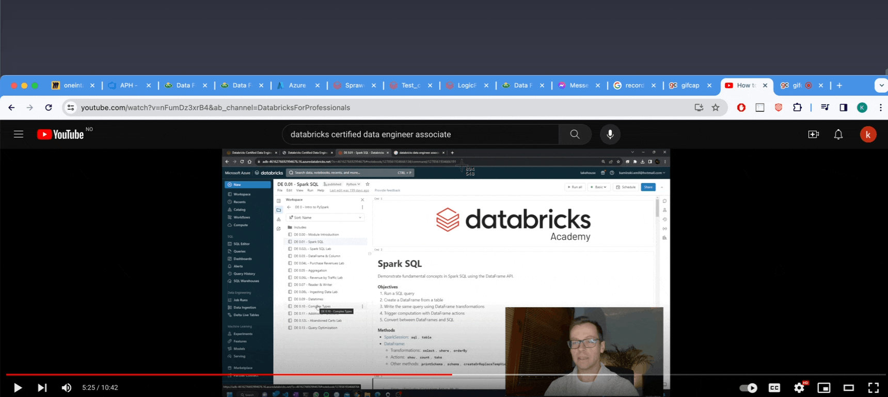

# Transform images from your clipboard to text in milliseconds from your terminal
This guide will help you set up an OCR (Optical Character Recognition) tool on your Mac. This tool allows you to convert images to text via the command line.

## Prerequisites

Before you begin, ensure you have the following installed:

1. **Tesseract OCR**: 
   - Install using Homebrew: 
     ```
     brew install tesseract
     ```

2. **pngpaste**: 
   - Install using Homebrew:
     ```
     brew install pngpaste
     ```
   - Alternatively, you can download it manually from their official repositories.

## Configuration (optional)

To use the OCR tool from any directory:

-  Add an alias to your terminal config file e.g `~/.bashrc`, `~/.zprofile` or a similar shell configuration file:
   - Add the following line:
     ```bash
     alias imageToText="bash /YOUR_PATH_TO_THIS_REPO/OCR.sh"
     ```
   - Replace YOUR_PATH_TO_THIS_REPO with the actual path you have cloned this to.

Alternatively, you can make the script executable (by running "_*chmod +x /YOUR_PATH_TO_THIS_REPO/OCR.sh*_") and add its directory to your PATH instead of using aliases.

## Usage

To convert an image to text:

1. Copy the desired image to your clipboard. This can be done via a screenshot or any other method of copying an image.
2. Open your terminal.
3. Run the command `imageToText` (given you added the alias. If not, go to the path you cloned this repo and run `bash OCR.sh`).
4. The text from the image will be printed in the console.

## Demo video

